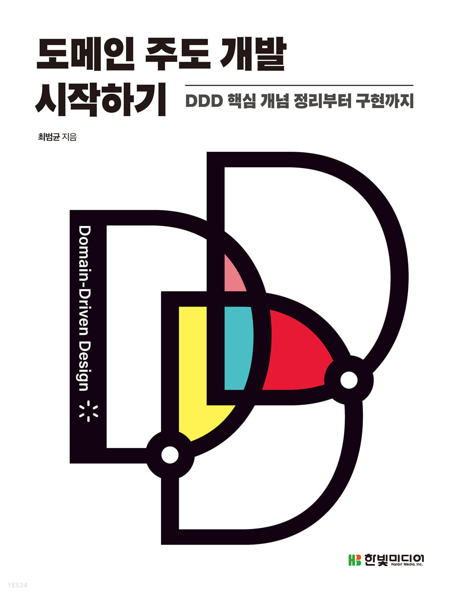

# DDD Start 북스터디

<p align="center"><a  href="https://book.naver.com/bookdb/book_detail.nhn?bid=22291738"></a></p>

## 스터디 목표
- [도메인 주도 개발 시작하기](https://book.naver.com/bookdb/book_detail.nhn?bid=22291738) 책을 읽고 DDD에 관한 개념을 익히기 위해 진행한다.

## 스터디 범위
  - 일주일에 3챕터씩 학습할 예졍
  - 이틀에 한 챕터씩 읽고 학습한다.
  
## 스터디 진행방식
- 글 작성법
  - /본인폴더/ch01.md 로 마크다운으로 작성
  - 이미지 같은 경우는 image에 본인이름+이미지명.png로 저장
    ```
    image/devksh930-image.png
    ```
  - 주말 마다 스터디 한부분에 대해서 토론을 하고 정리하는 시간을 가진다.
## 주의사항
- 본인이 읽고 나서 md를 작성해야함. 게시글을 퍼오거나 추가 학습한 부분은 반드시 출처를 표시할것.