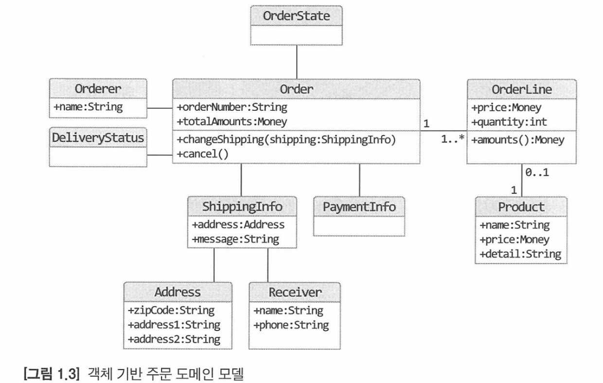

# 1. 도메인 모델 시작
---
## - 1.1 도메인이란?
###### 소프트웨어로 해결하고자 하는 문제 영역을 도메인이라고 한다.
###### 한 도메인은 여러 하위 도메인으로 분리 할 수 있다.
###### 하위 도메인들 간의 연동을 통해 완전한 기능을 제공하게 된다.

## - 1.2 도메인 전문가와 개발자 간 지식 공유
###### 개발자는 필요한 기능들의 요구사항을 분석하고 설계하여 개발을 하게된다
###### 그렇기 때문에 요구사항을 잘 못 이해할경우 잘못된 기능을 개발하게된다.
###### 이럴경우 작성한 코드를 올바르게 고치려하면 많은 시간과 노력이 필요해진다
###### 최악의 경우 일정이 밀리거나 제품을 만드는데 실패 할 수 있다
###### 그러므로 개발자도 도메인 지식을 어느정도 갖추어야 하고 도메인 전문가 , 관계자 , 개발자가
###### 같은 지식을 공유하고 직접 소통하여 요구사항을 잘 이해하는것이 중요하다.

## - 1.3 도메인 모델
##### **도메인 모델은 다양한 정의가 존재하지만 여기서 말하는 도메인 모델은 특정 도메인을 개념적으로 표현한것이다.**
#

###### 해당 이미지는 객체를 이용한 도메인 개념모델이다, 개념모델은 모든 내용을 담고있지는 않다.
###### 하지만 객체의 정보를 통해 어떠한 기능이 들어갈지 대략적으로 알 수 있다
###### Order는 OrderNumber와 totalAmounts를 통해 주문 번호 , 총 금액을 알 수 있고
###### ShippingInfo 객체와 Order객체의 changeShipping 메서드를 통해 배송 정보를 변경 할 수 있는것을 알 수 있다.
###### 도메인 모델을 표현할때 UML 표기법만 사용할 필요는 없다 그래프 , 수학 공식을 활용하여 모델링 할 수도 있다
###### 도메인을 이해하는데 도움이 된다면 표현방식은 관계 없다.  

###### 도메인 모델은 기본적으로 도메인 자체를 이해하기 위한 개념이다.
###### 개념모델 만으로는 바로 코드를 작성 할 수 없으므로 구현 기술에 맞는 구현 모델이 따로 필요하다
###### 구현 모델이 개념 모델을 최대한 따르게 하는것이 좋다.

## - 1.4 도메인 모델 패턴
##### **여기서의 도메인 모델은 마인 파울러가 쓴 "엔터프라이즈 애플리케이션 아키텍쳐 패턴" 책의 도메인 모델 패턴이다**
##### **아키텍처 상의 도메인 계층을 객체 지향 기법으로 구현하는 패턴을 말한다.**

######  일반적인 애플리케이션의 아키텍쳐는 다음과 같이 4 개의 영역으로 구성된다
- *표현 영역  - 사용자의 요청을 처리하고 사용자에게 정보를 보여준다*
- *응용 영역 - 사용자가 요청한 기능을 실행한다. 로직을 직접 구현하지않고 도메인 계층을 조합해서 기능을 실행*
- *도메인 영역 - 시스템이 제공할 도메인 규칙을 구현한다.*
- *인프라스트럭처 영역 - 데이터베이스 , 메시징 시스템과 같은 외부시스템과의 연동을 처리한다.*
#
###### 도메인 계층은 도메인의 핵심 규칙을 구현한다.
###### 예제에서는 주문도메인의 핵심 규칙으로 '출고전에만 배송지 변경 가능' ,'주문취소는 배송 전에만 가능' 등이 있다.
###### 이러한 규칙을 구현한 코드가 도메인 계층에 위치한다.
###### 도메인 규칙을 객체지향 기법으로 구현하는 패턴이 도메인 모델 패턴이다.
###### 핵심 규칙을 구현한 코드는 도메인 모델에만 위치하기때문에 변경,확장에 유연하다

## - 1.5 도메인 모델 도출
###### 도메인에 대한 이해 없이는 개발을 할 수 가 없다.
###### 도메인을 이해하고 이를 바탕으로 도메인 모델 초안이 있어야 개발을 할 수 있다.

#
###### 도메인을 모델링할때 기본이 되는 작업은
###### 모델을 구성하는 핵심 구성요소 , 규칙 , 기능을 찾아야한다.
#

###### 예시로 주문 도메인은 다음과 같은 요구사항을 가진다
- *최소 한 종류 이상의 상품을 주문해야한다*
- *한 상품을 한 개 이상 주문할 수 있다*
- *총 주문 금액은 각 상품의 구매 가격 합을 모두 더한 금액이다*
- *각 상품의 구매 가격 합은 상품 가격에 구매 개수를 곱한 값이다*
- *주문할 때 배송지 정보를 받드시 지정해야 한다*
- *출고 전에 주문을 취소할 수 있다*
- *출고를 하면 배송지 변경이 불가능하다*

###### 이 요구사항에서는 출고 상태 변경, 배송지 변경, 주문 취소 기능을 제공해야 한다는걸 파악할 수 있다.
###### 그렇기에 Order에 관련 기능을 메서드로 추가 할 수 있다.
#
###### 또한 한 상품을 한개이상 주문, 각 상품의 구매가격을 구하는 요구사항을 통해
###### 주문 항목을 표현하는 OrderLine Class 에는 상품 , 상품의 가격 , 구매 개수 포함해야 하는것을 알 수 있다.

#
###### 최소 한 종류 이상의 상품을 주문, 총 주문 금액은 구매 가격의 합이다 라는 요구 사항을 통해
###### Order는 무조건 한 개 이상의 OrderLine을 포함해야 한다는 것을 알 수 있다
#
#
###### 요구사항을 통해 도메인의 핵심 구성요소, 규칙, 기능을 찾아야 하는것이 중요하다.

## 1.6 엔티티와 밸류
###### 도출한 모델은 크게 엔티티와 밸류로 구분 할 수 있다.
###### 엔티티와 밸류를 제대로 구분해야 올바르게 설계하고 구현 할 수 있이게 이 둘의 차이점을 명확하게 이해해야 한다.
#

### 엔티티
###### 엔티티의 가장 큰 특징은 식별자를 가진다는 것이다.
###### 엔티티의 상태가 변경돼도 식별자는 바뀌지 않는다.
###### 엔티티의 식별자는 고유하기때문에 식별자가 같으면 두 엔티티는 같다고 판단 할 수 있다.
#

### 밸류 타입
###### 밸류 타입은 개념적으로 완전한 하나를 표현할때 사용한다
###### 에를 들어서 address1 , address2 , zipcode 라는 필드가 있을때 이것은 addresss라는 객체로 표현이 가능하다.
###### 밸류타입을 사용해서 얻을 수 있는 이점은 보다 명확하게 개념적으로 완전한 하나를 표현할 수 있다.
###### 또 다른 이점으로는 밸류 타입을 위한 기능(메서드)를 추가 할 수 있다
###### 밸류타입이 꼭 두개 이상의 데이터를 가질 필요는 없다, 의미를 명확하게 표현하기 위해 사용하는 경우도 있다.
#

###### 밸류 객체를 변경할때는 기존 데이터를 변경하기보다는 변경한 데이터를 갖는 새로운 객체를 생성하는게 좋다.
###### 불변으로 구현하게 되면 안전한 코드를 작성할 수 있다.
###### 개발자의 실수로 기존 데이터를 변경하게 됐을때 잘못된 값을 들어가는것을 방지할 수 있다.
#

### 엔티티의 식별자와 밸류 타입
###### 엔티티의 식별자는 String과 같은 문자열로 구성된 경우가 많다.
###### 이런 식별자는 단순한 문자열이 아니라 도메인의 특별한 의미를 가지는 경우가 많기 때문에
###### 식별자를 위한 밸류타입을 사용해서 의미를 잘 드러나게 하도록 할 수 있다.
#

### 도메인 모델에 set 메서드 넣지 않기
###### set 메서드를 사용할경우 이 메서드가 어떠한 기능을 하는지 명확하게 알 수 없다.
###### 그렇기 때문에 명확한 의도를 알 수 있는 메서드를 따로 만드는것을 권장한다.
###### 또한 set 메서드의 접근 제한자를 public으로 생성할 경우 도메인의 일관성이 깨지게 된다.

## - 1.7 도메인 용어와 유비쿼터스 언어
###### 유비쿼터스 언어란 전문가, 관계자, 개발자가 도메인과 관련된 공통 언어를 만들어
###### 이를 대화,문서,도메인,코드,테스트 등 모든 곳에서 같은 용어를 사용하기 위한것이다.
###### 변수, 메서드를 생성할때 도메인 용어를 사용하는게 아닌 도메인에 어울리지 않는 단어를 사용할 경우
###### 해당 코드가 어떤것인지에 대한 불필요한 변환 과정이 필요하게 될것이다.
###### 도메인에 맞는 단어를 찾도록 노력해야한다.

