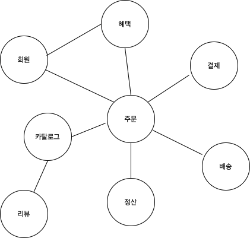

# 1. 도메인 모델 시작

## 도메인
개발자 입장에서 온라인서점은 구현해야할 대상이 된다.  
온라인 서점 소프트웨어는 온라인으로 책을 파는데 필요한 **상품조회**, **구매**, **결제**, **배송 추적** 등의 기능을 제공한다.  
이때 온라인 서점 소프트웨어로 **해결하려고 하는 문제 영역**이 도메인이다.  

## 하위 도메인
  
한 도메인은 다시 하위 도메인으로 나뉘어 진다.
- 카탈로그 : 고객에게 구매할수 있는 상품목록 제공
- 주문 : 고객의 주문을 처리
- 혜택 : 특별할인과 같은 서비스 제공
- 배송 : 고객에게 구매한 상품을 전달하는 일련의 과정 처리

하위 도메인 들은 다른 하위 도메인들과 연동하여 완전한 기능을 제공하게 되는데    
고객이 주문을 하게 된다면 주문 -> 결제 -> 배송 --> 혜택 등의 도메인들과 상호작용을 하게 된다.  
온라인서점을 위한 도메인(특정 도메인)이라고 해서 하위도메인의 모든 기능을 이용하는 것이 아닌   
배송, 결제등과 같은 일부기능은 자체 시스템으로 구현하고 나머지기능은 외부 업체의 시스템을 이용한다  


```
하위 도메인 도메인 마다 고정된것이 아니다 상황에 따라 하위도메인을 구성한다
```
### 예시
- 소규모 업체는 엑셀과 같은 도구를 이용해 정산 처리를 한다
- 대형장비를 파는 곳은 온라인으로 카탈로그를 제공하고 주문서 받는정도만 필요한다.


## 도메인 전문가와 개발자간의 지식 공유
- 개발자는 개발에 앞서 도메인 요구 사항에 대한 올바른 이해를 필요로 한다.
- 요구사항을 올바르게 이해하지 못하면  쓸모가 없거나 유용함이 떨어지는 시스템을 만들 가능성이 높아진다
- 개발자는 도메인 전문가와 직접 대화해 정보의 왜곡을 최소화 한다
- 개발자는 도메인 전문가 만큼은 아니더라도 도메인지식을 갖춰야한다.
