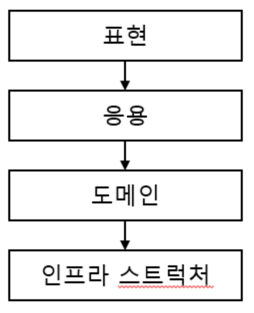
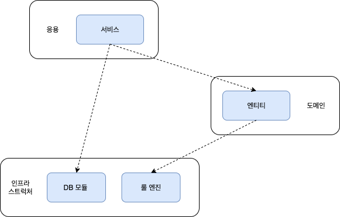

# 2. 아키텍처 개요

## 2-1 네개의 영역

아키텍처를 설계할때 현하는 전형적인 네가지 영역이 있다.

- 표현(presentation) : 사용자의 요청을 받아 응용 영역에 전달, 응용역역의 처리결과를 다시 사용자에게 보여주는 역할
- 응용(application)  : 사용자에게 제공해야 할 기능을 구현, 도메인영역의 도메인 모델을 사용
- 도메인(domain)     : 도메인의 핵심 로직을 구현
- 인프라스트럭쳐(infra) : 구현기술에 대한 실제 구현을 다룬다 .

## 2-2 계층 구조 아키텍처

일반적으로 많이 상요하는 아키텍처는 다음과 같은 계층 구조이다.  


- 계층 구조는 그 특성상 상위 계층에서 하위 계층으로의 의존만 존재 한다.(하위 계층은 상위 계층에 의존하지 않는다.)
- 계층 단계별로 의존해야 하지만 편의를 위해 계층 구조를 다음 그림과 같이 유연하게 사용하기도 한다  

  
- 이러한 계층 구조는 직관적으로 시스템을 이해하기 쉬워지나 계층들이 인프라스트럭쳐 계층에 종속되어 버린다.
- 인프라스트럭쳐 계층에 의존하면 테스트와 기능 확장이 어려워 진다.

## 2-3 DIP
저수준의 모듈이 고수준의 모듈을 의존 하게 되는것을 DIP라 한다.  
계층형 아키텍처를 고수준 모듈과 저수준 모듈에 맞춰서 보면 고수준의 모듈은 응용계층이나 도메인 계층, 저수준 모듈은 인프라스트럭쳐 계층이라고 볼수 있다.  


흔히 고수준 모듈이 저수준 모듈에 의존하도록 구현한다 이 경우에는 저수준 모듈이 변경되면 고수준 모듈의 변경이 이뤄진다.  

DIP를 적용하면 구현 변경의 어려움과 테스트의 어려움 2가지 문제를 해결할수 있다.
- 구현 기술을 변경하더라도 생성자에 넘기는 객체만 변경해서 넘겨주면 된다.
- 테스트 프레임워크를 이용한다면 저수준 모듈의 Mock 이나 Stub은 손쉽게 만들수 있다.


## 2-4 도메인 영역의 주요 구성요소
도메인 영역을 구성하는 요소
- 엔티티
  - 고유의 식별자를 갖는 객체로 자신의 라이프 사이클을 갖는다. 도메인의 고유한 개념을 표현, 도메인 데이터를 포함한다
- 벨류
  - 고유의 식별자를 갖지 않는 객체로 주로 개념적으로 하나인 값을 표현할 경우 사용한다. 엔티티의 속성이나 다른 벨류타임의 속성으로도 사용한다.
- 에그리거트
  - 연관된 엔티티와 벨류 객체를 개념적으로 하나로 묶은것
- 리포지터리
  - 도메인 모델의 영속성을 처리, dbms 테이블에서 객체를 로딩, 저장 기능을 제공
- 도메인서비스
  - 엔티티에 속하지 않은 도메인 로직을 제공. 도메인 로직이 여러 엔티티와 밸류가 필요로 하면 도메인 서비스에서 로직을 구현.

#### 엔티티와 밸류
도메인 모델 와 DB 관계형 모델의 엔티티는 같은것이 아니다.  
도메인 모델의 엔티티는 데이터와 함께 도메인 기능을 함께 제공한다.
```text
예를 들어 주문을 표현한느 엔티티는 주문과 관련된 데이터 뿐 아니라 배송지 주소 변경을 위한 기능을 제공한다.
```
또 도메인 모델의 엔티티는 두 개 이상의 데이터가 개념적으로 하나인 경우 `밸류`를 통해서 표현이 가능하다.

#### 에그리거트
관련 객체를 하나로 묶은 군집이다. 
```text
주문이라는 도메인은 배송지정보, 주문자, 주문목록, 총 결제 금액 의 하위 모델이 구성된다. 이 하위 개념을 표현한 모델을 하나로 묶어 주문 이라는 상위 개념으로 표현가능하다.
```
에그리거트를 사용하면 개별 객체간의 관계가 아닌 애그리거트 간의 관계로 도메인 모델을 이해하고 구현하게 되며 이를 통해 큰 틀에서 도메인 모델을 관리할수 있다.  


에그리거트 군집에 속한 객체를 관리하는 루트 엔티티를 갖는데 루트 엔티티는 에그리거트에 속해 있는 엔티티와 밸류 객체를 이용해서 구현해야할 기능을 구현한다.


#### 리포지터리
도메인 객체를 지속적으로 사용하려면 RDBMS, NoSQL, 로컬파일과 같은 물리적인 저장소에 도메인 객체를 보관해야한다.  
이를 위한 도메인 모델이 리포지터리이다. 리포지터리는 에그리거트 단위로 도메인 객체를 저장하고 조회하는 기능을 정의힌다.
도메인 모델 관점에서 Repository인터페이스는 도메인 객체를 영속화하는데 필요한 기능을 추상화 한것으로 고수준 모듈에 속한다.  
기반 기술을 이용해서 Repostiroy를 구현하 클래스는 저수준의 모듈로 인프라스트럭쳐에 해당한다.

