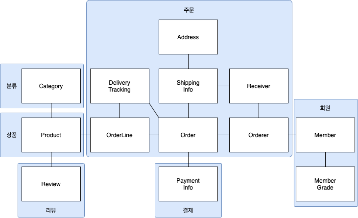

# 3. 애그리거트

## 3.1 애그릭거트

백 개 이상의 테이블을 한 장의 ERD에 모두 표시하면 개별 테이블 간의 관계를 파악하느라 큰틀에서 데이터 구조를 이해 하는데 많은 어려움을 격게 된다.  
주요 도메인간의 관계를 파악하긱 어렵다는 것은 코드를 변경하고 확장하는데 많은 어려움이 따른다. 복잡한 도메인을 이해하고 쉬운 단위로 만들려면  
상위 수준에서 모델을 들여다볼 수 있는 방법이 필요하다. 이 방법이 애그리거트 이다.



- 애그리거트 단위로 일관성을 관리하기 때문에 복잡한 도메인을 단순한 구조로 만들어준다.
- 애그리거트에 속한 객체는 동일한 라이프 사이클을 갖는다.
- 애그리거트에 속한 객체는 다른 애그리거트에 속하지 않는다.
    - 주문 애그리거트는 배송지를 변경하걱나 상품 개수를 변경하는 등 자기 자신 관리는 자기가 하지만 주문애그리거트는 회원의 비밀번호를 변경하거나 상품의 가격을 변경하지 않는다.

#### 에그리거트의 경계설정

흔히 `A has a B`라는 관계가 성립하는 요구사항이 존재하면 A와 B를 하나의 애그리거트로 묶어서 생각하기 쉽다.  
하지만 Product와 Review의 관계를 보게 되면 서로 다른 애그리거트다.

- Product와 Review가 함께 생성되지 않고 함꼐 변경되지 않는다(라이프사이클을 달리한다)
- Product를 변경하는 주체가 상품 담당자라면 Review를 생성하고 변경하는 주체는 고객이다.
- Review의 변경이 Product에 영향을 주지도 않고 반대의 경우도 동일하다.

책에서 저자는
*처음 도메인을 만듦면 큰 애그리거트로 보이는 것들이 많지만 도메인에 대한 규칙을 제대로 이해할 수록 애그리거트의 실제 크기는 작아지며
다 수의 애그리거트가 한개의 엔티티 객체만 갖는 경우가 많았으며 두개 이상의 엔티티로 구성되는 엔티티는 드물었다 라고 말한다.*

## 3.2 애그리거트 루트

애그리거트는 여러 객체로 구성되기 때문에 한객체만 상태가 정상이면 안된다. 도메인 규칙을 지키려면 애그리거트에 속한 모든 객체가 정상 상태를 가저야 한다.  
애그리걱트에 속한 모든 객체가 일관된 상태를 유지하려면 애그리거트 전체를 관리할 주체가 애그리걱트 루트이다.

#### 도메인 규칙과 일관성

애그리거트 루트의 핵심 역할은 애그리거트의 일관성이 깨지지 않도록 하는 것이다.

```java
public class Order {

    public void changeShippingInfo(ShippingInfo newShippingInfo) {
        verfyNotYetShipped();
        setShippingInfo(newShippingInfo);
    }

    private void verifyNotYetShipped() {
        if (state != OrderState.PAYMENT_WATTING && state != OrderState.PREPARING) {
            throw new IllegalStateException("aleady shipped");
        }
    }
}
```

- Order의 `changeShippingInfo()`는 도메인 규칙에 따라 배송 시작 여부를 확인하고 규칙을 충족할 때만 배송정보를 변경해야한다.

애그리거트 외부에서 애그리거트에 속한 객체를 직접 변경하면 안 된다.

```java
ShippingInfo si=order.getShippingInfo();
        si.setAddress(newAdderess);
```

- 해당 코드는 애그리거트 루트에서 ShipppingInfo를 가져와 직접 정봅를 변경한다.
- 주문상태와 상관없이 배송지 주소를 변경하는데 이는 도메인 규칙을 무시하고 직접 DB테이블의 데이터를 수정하는 것과 같은 결과를 만든다.
- 논리적인 데이터의 일관성이 깨진다.
- 일관성을 지키기 위해 검사로직을 구현하게 되는데 이는 동일한 검사로직을 여러 응용 서비스에 중복으로 구현할 가능성이 높아지게된다.

이처럼 불필요한 중복을 피하고 애그리거트루트를 통해서만 도메인로직을 구현하게 만들려면 두가지 습관을 적용해야한다.

#### 단순히 필드를 변경하는 set메서드를 공개(public) 범위로 만들지 않는다.

- public set 메서드는 도메인의 의미나 의도를 표현하지 못한다.
- 도메인 로직을 응용영역 및 표현영역으로 분산 시킨다.

#### 밸류타입은 불변으로 구현한다.

공개 set메서드를 만들지 않는 연장선으로 밸류는 불변 타입으로 구현한다.
애그릭거트 외부에서 내부 상태를 함부로 바꾸지 못하므로 애그리걱트의 일관성이 깨질 가능성이 줄어든다.  
밸류 객체가 불변이면 밸류객체의 값을 변경하는 방법은 애그리거트 루트가 제공하는 메서드로 새로운 밸류객체를 전달해서 만드는 방법 밖에 없다.

#### 트랙잭션 범위

트랜잭션의 범위는 작아야한다 한 트랜잭션에서 여러개의 테이블을 변경을 하면 트랜잭션의 잠금 대상이 많이지는데  
이는 동시에 처리할수 있는 트랜잭션 개수가 줄어들고 전체적인 성능(처리량)을 감소 시킨다.

한 트랜잭션 안에서는 한 개의 애그리거트만 수정 해야한다. 두개 이상의 애그리거트를 수정할시 트랜잭션 충돌이 발생할 가능성이 높아지게 된다.  
애그리거트 내부에서 다른 애그리거트의 상태를 변강하는 기능을 실행하면 안된다.

배송지 정봅를 변경하면서 동시에 배송지 정보를 회원의 주소로 설정하는 기능이 있다고 치면 주문 애그리거트는 회원 애그리거트의 정보를 변경하면 안된다.  
애그리거트가 자신의 책임 범위를 넘어 다른 액그리거트의 상태까지 관리하는 꼴이 된다.

부득이 하게 한 트랜잭션으로 두 개 이상의 애그리거트를 수정해야 한다면 애그리거트에서 다른 애그리거트를 수정하기보단 응용서비스에서 두 애그리거트를  
수정해야한다.

도메인 이벤트를 사용하면 한 트랜잭션에서 한 개의 애그리거트를 수정하면서도 동기나 비동기로 다른 애그리거트의 상태를 변경하는 코드 작성이 가능하다.

한 트랜잭션 내에서 한개의 애그리거트를 변경하는것을 권장한다. 하지만 다음의 경우에서는 두개이상의 애그리거트를 변경하는 것을 고려 가능하다.

- 팀 표준 : 팀이나 조직의 표준에 따라 사용자 유스케이스와 관련된 응용 서비스의 기능을 한 트랜잭션으로 실행해야 하는 경우
- 기술제약 : 기술적으로 이벤트 방식을 도입할 수 없는 경우 한 트랜잭션에서 다수의 애그리거트를 수정해서 일관성을 처리해야한다.
- UI구현의 편리 : 운영자의 편리함을 위해 주문 목록 화면에섯 여러 주문의 상태를 한 번에 변겨여하고 싶을 경우 한 트랜잭션에서 여러 주문 애그리거트 상태를 변경해야한다.

## 3.3 리포지터리와 애그리거트

애그리걱트는 개념상 완전한 한개의 도메인 모델을 표현하믐로 객체의 영속성을 처리하는 리포지터리는 애그리거트 단위로 존재한다.  
`Order`와 `OrderLine`을 물리적으로 각각 별도의 DB테이블에 저장한다고 해서 각각 리포지터리를 만들지 않고 애그리거트 루트인  
`Order`만 리포지터리로 존재한다.

## 3.4 ID를 이용한 애그리거트 참조

JPA의 연관관계 매핑을 활용하면 연관된 객체를 필드를 통해 다른 애그리거트를 참조 할수 있다.  
하지만 필드를 이용한 애그리거트 참조는 다음 문제를 야기한다.

- 편한 탐색 오용
- 성능에 대한 고민
- 확장 어려움

애그리거트를 직접 참조할 때 발생할수 있?는 가장 큰 문제는 편리함을 오용할 수 있따는 것이다. 한 애그리거트 내부에서 다른 애그리거트 객체에  
접근할 수 있으면 다른 애그리거트의 상태를 쉽게 변경할 수 있게 된다. 트랜잭션 범위에서 언급한 것처럼 애그리거트가 관리하는 범위는 자기 자신으로 한정해야한다.

애그리거트를 직접 참조하면 성능과 관련된 여러 가지 고민을 해야한다. JPA를 사용해 참조한 객채들은 LAZY로딩, EAGER로딩 두가지 방식으로 로딩이 가능한다.  
두 로딩 방식 중 무엇을 사용할지는 애그리거트의 어떤 기능을 사용하느냐에 따라 달라진다.

초기에는 단일 서버에 단일 DBMS로 서비스를 제공하는 것이 가능 하지만 사용자가 늘고 트래픽이 증가하면 자연스럽게 부하를 분산하기 위해 하위 도메인 별로  
시스템을 분리한다. 이 과정에서 하위도메인마다 서로다른 DBMS를 사용할 때도 존재하는데 이는 더이상 다른 애그리거트루트를 참조하기 위해 JPA와 같은 단일 기술을 사용할수 없음을 의미한다.

이런 3가지 문제를 완화하기 위해 ID를 이용해서 다른 애그리거트를 참조하는 것이다. DB테이블에서 외래키로 참조하는 것과 비슷하게 ID를 이요한 참조는 다른 애그리거트를 참조하기위해 ID를 사용한다.

ID참조를 사용하면 모든 객체가 참조로 연결되지 않고 한 애그리거트에 속한 객체들만 참조로 연결된다. 참조하는 다른 애그리거트가 필요하면 응용서비스에서 ID를 이용해서 로딩하면 된다.  
ID를 이용한 참조 방식을 사용하면 구현복잡도도 낮아지고 한 애그리거트에서 다른 애그리거트를 수정하는 문제를 근본적으로 방지가 가능하며 애그리거트별 다른 구현 기술을 사용하는 것도 가능해진다.

#### ID를 이용한 참조와 조회 성능

다른 애그리거트를 ID로 참조하게 되면 여러 애그리거트를 읽을때 조회속도가 문제가 될수도 있다.  
여러 애그리거트를 읽을때 N+1 조회문제가 발생할 가능성이 높은데 해결방안으론 DAO를 만들고 DAO 조회 메서드에서 조인을 이용해 한번의 쿼리로 필요한 데이터를 로딩하면 된다.
또 애그리거트마다 다른 저장소를 사용하게 되면 한 번의 쿼리로 관련 애그리거트를 조회할 수 없다. 이때 조회성능을 높이기 위해 캐시를 적용한다던지 조회전용 저장소를 구성해야한다.

## 3.5 애그리거트 간 집합 연관

1:N과 M:N관계 일때도 성능에 유리한 맵핑방법이 존재한다.

```java
public class Category {
    private Set<Product> products;
}
```

- 해당 방법은 카테고리에 속해 있는 상품을 보여주려 모든 Product를 로딩한다
- Product의 갯수가 많아지면 많아질수록 성능에 문제를 일으킬 가능성이 높아진다

```java
public class Product {
    private CategoryId categoryId;
}
```

- 해당 방법을 이용하면 상품의 입장에서 상품이 속해있는 카테고리를 로딩하는 것이 효율 적이다.

## 애그리거트를 팩토리로 사용하기
응용서비스에서 도메인로직이 노출되지 않도록 하는 것이 좋다. 애그리거트가 갖고 있는 데이터를 활용해서 다른 애그리거트를 생성해야 한다면  
애그리거트에 팩토리 메서드를 구현하는것을 고려해보자. 


